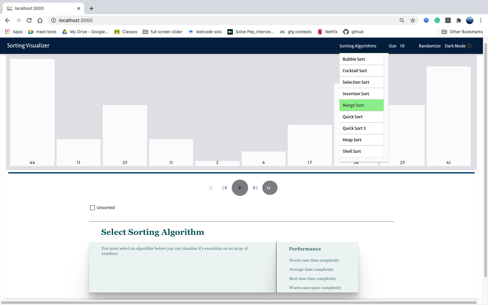
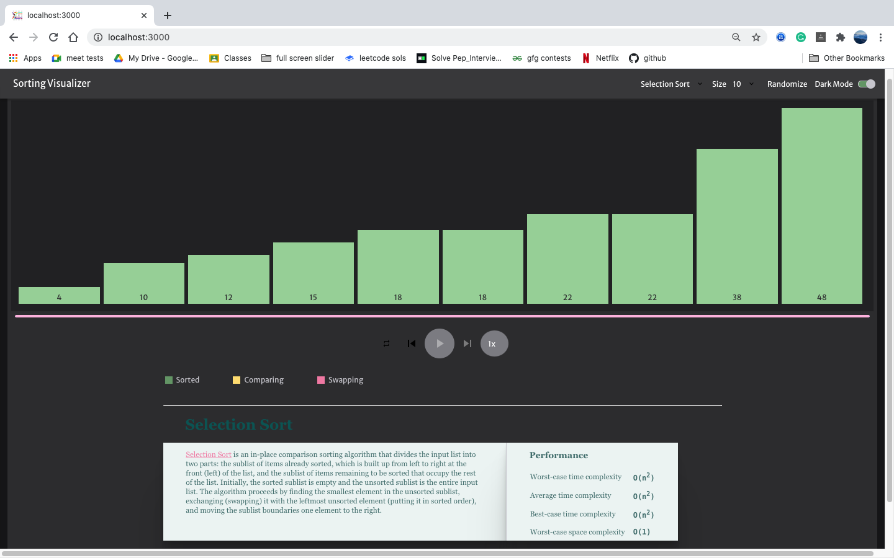
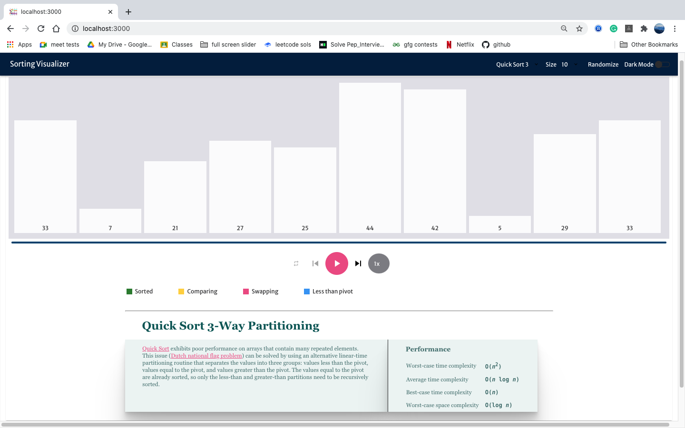

# Sorting-Algorithms-Visualizer
A web app in react to visualize various sorting algorithms.The following algorithms are visualised in this project:
1.Bubble Sort
2.Cocktail Sort(Improved version of Bubble Sort)
3.Selection Sort
4.Insertion Sort
5.Heap Sort
6.Merge Sort
7.Shell Sort
8.Quick Sort
9.Quick Sort wit 3 way partitioning

Link to the app
https://sanyagoyal2000.github.io/Sorting-Algorithms-Visualizer/

DEMO

